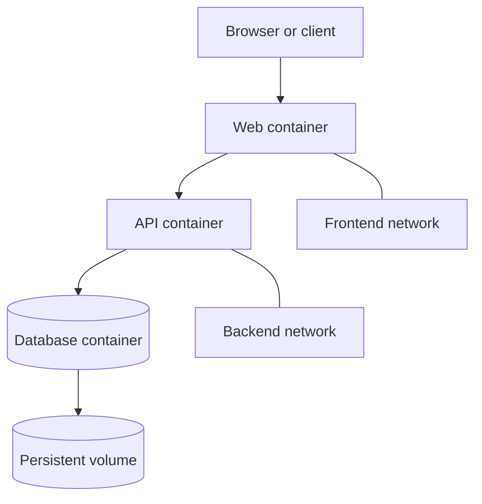

# Compose application

```mermaid
flowchart TB
    Client[Browser or client] --> Web[Web container]
    Web --> API[API container]
    API --> DB[(Database container)]
    DB --> Vol[(Persistent volume)]
    Web --- Front[Frontend network]
    API --- Back[Backend network]
```
